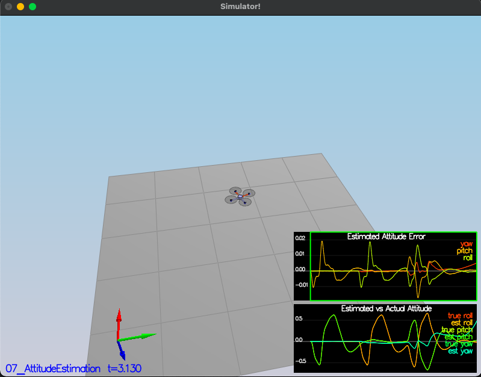
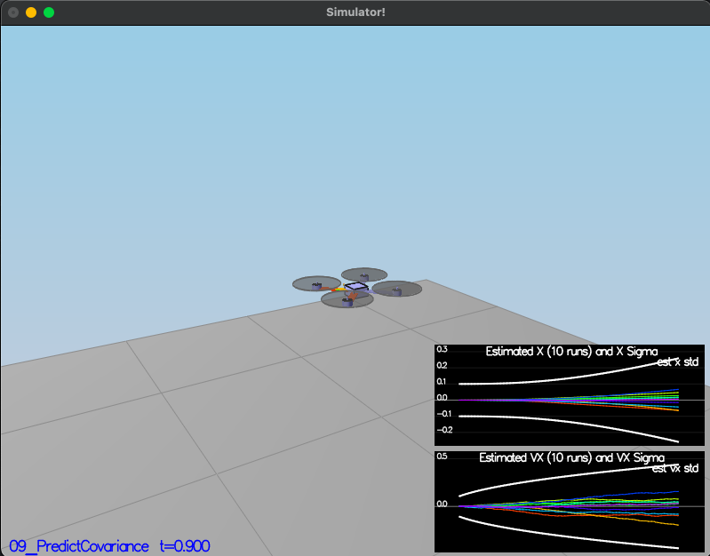
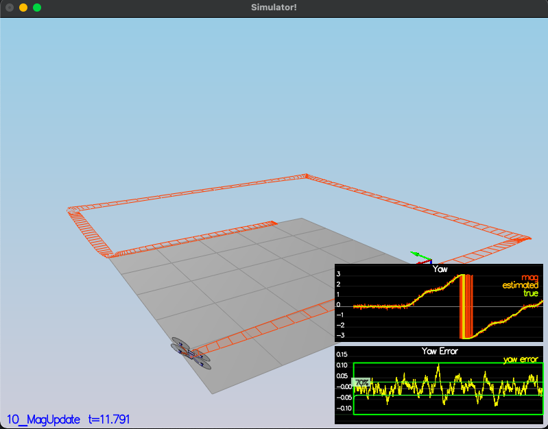
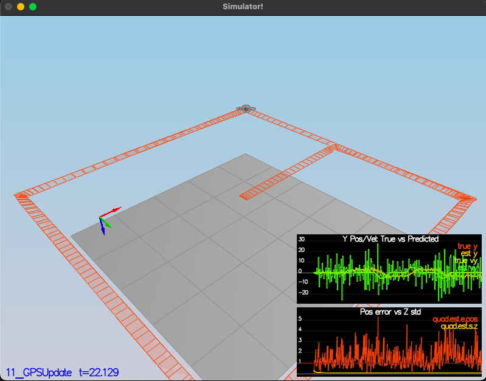

# Quadrotor Estimation Project - Udacity Flying Car ND #
##### Project writeup #####

To completing this project the main tasks included the prediction of quadrotors by impementing Extended Kalman Filter (EKF) and integrating the previously tuned Controller and other configuration bits to tuning the Estimators' parameters for a good performance. 


## Project tasks ##

The evaluation of the projects tasks' was done in the CPP simulator auto-grading each task as pass or fail. The tasks included for the Estimation project were as follows. 

 - [Sensor Noise](#step-1-sensor-noise)
 - [Attitude Estimation](#step-2-attitude-estimation)
 - [Prediction Step](#step-3-prediction-step)
 - [Magnetometer Update](#step-4-magnetometer-update)
 - [Closed Loop + GPS Update](#step-5-closed-loop--gps-update)
 - [Adding Your Controller](#step-6-adding-your-controller)

(The project scenarios - which were not part of the assessment - included also the previuosly tuned scenarios which can be found: https://github.com/USinani/Flying-Car-and-Autonomous-Flight-Engineer-ND/blob/main/3-Quadrotor_Controls/Writeup_report.md)

(An illustration scenario of the evaluation from the simulator environment: 


### Sensor Noise ###

For the controls project,the simulator was working with a perfect set of sensors, meaning none of the sensors had any noise.  The first step to adding additional realism to the problem, and developing an estimator, is adding noise to the quad's sensors.  For the first step, you will collect some simulated noisy sensor data and estimate the standard deviation of the quad's sensor.

Running the simulator and selecting the 06_NoisySensors scenario the following results were obtained:


### Attitude Estimation ###

Now let's look at the first step to our state estimation: including information from our IMU.  In this step, you will be improving the complementary filter-type attitude filter with a better rate gyro attitude integration scheme.

In `QuadEstimatorEKF.cpp`, you will see the function `UpdateFromIMU()` contains a complementary filter-type attitude filter.  To reduce the errors in the estimated attitude (Euler Angles), implement a better rate gyro attitude integration scheme.  You should be able to reduce the attitude errors to get within 0.1 rad for each of the Euler angles, as shown in the screenshot below.



In the screenshot above the attitude estimation using linear scheme (left) and using the improved nonlinear scheme (right). Note that Y axis on error is much greater on left.

***Success criteria:*** * Attitude estimator needs to get within 0.1 rad for each of the Euler angles for at least 3 seconds.*

**Hints provided: section 7.1.2 of [Estimation for Quadrotors](https://www.overleaf.com/read/vymfngphcccj) for a refresher on a good non-linear complimentary filter for attitude using quaternions.**


### Prediction Step ###

Implementing the prediction step of the filter introduced a close to realistic scenario of an IMU onboard of the quadcopter. Running the scenario `08_PredictState` the follwoing illustration - estimating the state and that of the true state - were obtained.

Code implementation involved `QuadEstimatorEKF.cpp`, implementing the state prediction step in the `PredictState()` function. Running the scenario `08_PredictState` the estimator state track the actual state obtained is shown in the figure below:


The following scenario `09_PredictionCov` introduced a realistic IMU, one with noise. Running it in the simulator a small fleet of quadcopters will appear - using the prediction code - and will simulate the case of forward integration. 

From the standpoint of code implementation it included `QuadEstimatorEKF.cpp` calculating the partial derivative of the body-to-global rotation matrix in the function `GetRbgPrime()`. This function implementation proceeded with the prediction step (the state covariance forward) in `Predict()`.
From the configuration aspect, running covariance prediction and tuning the `QPosXYStd` and the `QVelXYStd` process parameters was done in `QuadEstimatorEKF.txt` which allowed to capture the magnitude of the noticeable errors. Running the simulator the following results were obtained.
 
A good solution looks as follows:



Note: Increased errors over time - in this simplified model - will not capture the real error dynamics (for example, specifically, coming from attitude errors), thus it is noticeable only for a relatively short prediction period (the scenario is set for one second).
   - The top graph shows 10 (prediction-only) position X estimates
   - The bottom graph shows 10 (prediction-only) velocity estimates
Note: The estimated covariance (white bounds) currently do not capture the growing errors.

**Hints provided: section 7.2 of [Estimation for Quadrotors](https://www.overleaf.com/read/vymfngphcccj) for a refresher on the the transition model and the partial derivatives you may need**

**When it comes to writing the function for GetRbgPrime, make sure to triple check you've set all the correct parts of the matrix.**

**Recall that the control input is the acceleration!**

Additional illustration examples:


Another set of bad examples is shown below for having a `QVelXYStd` too large (first) and too small (second).  As you can see, once again, our covariances in these cases no longer model the data well.


***Success criteria:*** *No specific measurable criteria being checked.*


### Magnetometer Update ###

From the previous implementations up to now the use of accelerometer and gyro for our state estimation was used. Thus, in this step additional information from the magnetometer was added. Its implementation showed to improve filter's performance in estimating the vehicle's heading.

Below are given the Implementation steps.

1. Initiating scenario `10_MagUpdate` which uses a realistic IMU, yet without magnetometer update.  

2. Tuning `QYawStd` parameter from (`QuadEstimatorEKF.txt`) for the QuadEstimatorEKF to approximately capture the magnitude of the drift.

3. Implementing magnetometer update in the function `UpdateFromMag()`.

Magnetometer scenario - obtained results from the simulator.


***Success criteria:*** *The goal is to both have an estimated standard deviation that accurately captures the error and maintain an error of less than 0.1rad in heading for at least 10 seconds of the simulation.*

**Hints provided: after implementing the magnetometer update,tuning the parameter `QYawStd` for a better balance is required. **

**Hint: see section 7.3.2 of [Estimation for Quadrotors](https://www.overleaf.com/read/vymfngphcccj) for a refresher on the magnetometer update.**


### Closed Loop + GPS Update ###

Adding the GPS update with the closed loop added additional drone handling to estimating its position and minimising errors accross various scenarios. The main steps to implementating it were as listed.

1. Running scenario `11_GPSUpdate`.  This scenario uses both an ideal estimator and and ideal IMU.  Noticably the position and velocity errors drifting away, due to missing GPS implemented and update.

2. Using my own estimator by setting `Quad.UseIdealEstimator` to 0 in `config/11_GPSUpdate.txt`.  and Re-running the scenario to get a performance outlook of the estimator work with an ideal IMU.

3. Repeating the step with realistic IMU in `config/11_GPSUpdate.txt`:
```
#SimIMU.AccelStd = 0,0,0
#SimIMU.GyroStd = 0,0,0
```

4. Tune the process noise model in `QuadEstimatorEKF.txt` to try to approximately capture the error with the estimated uncertainty (standard deviation) of the filter.

5. Implementation of the EKF GPS Update in the function `UpdateFromGPS()`.

6. Re-run the simulation with the objective to complete the entire simulation cycle with estimated position error of < 1m.

GPS Updates scenario - obtained results from the simulator.



***Success criteria:*** * Completion of the entire simulation cycle with estimated position error of < 1m.*

**Hint: see section 7.3.1 of [Estimation for Quadrotors](https://www.overleaf.com/read/vymfngphcccj) for a refresher on the GPS update.**


### Adding my own Controller ###

This step required the replacement of the default controller - adept to work with an estimated state - with the one from the previous project (Colltroller CPP project). Code implementation included the following steps

1. Replacing `QuadController.cpp` with the controller written from previous project.

2. Replacing `QuadControlParams.txt` with the control parameters from the last project.

3. Running scenario `11_GPSUpdate`.

Below is shown the result from the performance of the controller for all scenarios.


**Hints: It is easier to do the de-tuning as a 2 step process by reverting to ideal sensors and de-tuning under those conditions first.**

***Success criteria:*** *The objective was to complete the entire simulation cycle with estimated position error of < 1m.*


## Tips and Tricks provided from Udacity ##

When working for this project the below tips and tricks provided from udacity became helpful.

 - Transposing matrices, `.transposeInPlace()` is the function you want to use to transpose a matrix

 - The [Estimation for Quadrotors](https://www.overleaf.com/read/vymfngphcccj) document contains a helpful mathematical breakdown of the core elements on your estimator

## Project requirement's summary ##

The completion of this project required the completion and submission of the following files:

 - a completed estimator that meets the performance criteria for each of the steps by submitting:
   - `QuadEstimatorEKF.cpp`
   - `config/QuadEstimatorEKF.txt`

 - a re-tuned controller that, in conjunction with your tuned estimator, is capable of meeting the criteria laid out in Step 6 by submitting:
   - `QuadController.cpp`
   - `config/QuadControlParams.txt`

 - a write up addressing all the points of the rubric

## Authors ##
Uljan Sinani &
Thanks to Fotokite for the initial development of the project code and simulator.
